# HA Gateway

## 1. System Overview

### High-Level Architecture

The HA RPC Gateway is a HA proxy for Eth json rpc requests that with load balancing, circuit breaking, and caching capabilities.

**Architecture Flow:**


### Core Components

1. **Gateway Server** (`main.rs`)
   - HTTP server listening on `0.0.0.0:8080`
   - Endpoints: `/rpc` (main), `/health`, `/status`
   - Request routing and response handling

2. **Load Balancer** (`load_balancer.rs`)
   - Round-robin node selection
   - Health-aware routing (skips unhealthy nodes)
   - Background health checker task

3. **Upstream Nodes** (`upstream.rs`) 
   - Running local_eth using Anvil with three RPC proxies behind Nginx
   - Individual node health tracking
   - Automatic failure detection and recovery

4. **Cache** (`cache.rs`)
   - LRU cache with time-based expiration
   - Thread-safe concurrent access
   - Reduces load on upstream nodes


---

## 2. State Machine: Upstream Node States

### Node State Diagram

**State Transition Details:**

```mermaid
stateDiagram-v2
    [*] --> Healthy: Node Created
    
    Healthy --> Healthy: Success<br/>(Reset Counter)
    Healthy --> Healthy: 1-2 Failures<br/>(Increment Counter)
    Healthy --> Unhealthy: 3rd Consecutive Failure<br/>(Open Circuit)
    
    Unhealthy --> Unhealthy: Health Check Fails<br/>(Still in Cooldown)
    Unhealthy --> Healthy: Health Check Success<br/>(Close Circuit)
    
    note right of Healthy
        - Accepts traffic
        - Failure counter: 0-2
        - No cooldown
    end note
    
    note right of Unhealthy
        - Rejects traffic
        - Failure counter: ≥3
        - Cooldown: 60 seconds
    end note
```



### Circuit Breaker Parameters

- **Failure Threshold**: 3 consecutive failures
- **Cooldown Duration**: 60 seconds
- **Request Timeout**: 5 seconds
- **Health Check Interval**: 10 seconds

---

## 3. Data Models

### JSON-RPC Request Schema

```rust
struct RpcRequest {
    jsonrpc: String,      
    method: String,       
    params: Value,          
    id: Value,  
}
```

**Example:**
```json
{
  "jsonrpc": "2.0",
  "method": "eth_blockNumber",
  "params": [],
  "id": 1
}
```

### JSON-RPC Response Schema

```rust
struct RpcResponse {
    jsonrpc: String,              
    result: Option<Value>,       
    error: Option<RpcError>,    
    id: Value,                
}

struct RpcError {
    code: i32,                   
    message: String,             
    data: Option<Value>,  
}
```

**Success Example:**
```json
{
  "jsonrpc": "2.0",
  "result": "0x1be6",
  "id": 1
}
```

**Error Example:**
```json
{
  "jsonrpc": "2.0",
  "error": {
    "code": -32600,
    "message": "Invalid Request"
  },
  "id": 1
}
```

---

## 4. Scenarios and Decision Flow

### Scenario 1: Successful Request with Cache Hit


**Decision Points:**
- Cache key generation from request method
- Cache hit returns immediately, bypassing load balancer

### Scenario 2: Cache Miss with Healthy Node


**Decision Points:**
- Cache miss triggers load balancer
- Round-robin selects next healthy node
- Success resets failure counter
- Response cached for future requests

### Scenario 3: Node Failure and Circuit Opening


**Decision Points:**
- 3rd consecutive failure triggers circuit breaker
- Node marked unhealthy with timestamp
- Future requests skip this node

### Scenario 4: All Nodes Unhealthy


**Decision Points:**
- Load balancer checks all nodes
- No healthy nodes available
- Return 503 error to client

### Scenario 5: Health Check Recovery


**Decision Points:**
- Health checker runs every 10 seconds
- Successful health check recovers node
- Node becomes available for traffic

### Scenario 6: Concurrent Request Handling


**Decision Points:**
- Atomic counter prevents race conditions
- Each request gets next node in sequence
- Load distributed evenly across healthy nodes

---

## 5. Assumptions and Trade-offs

### Trade-offs of Load Balancing?
- **No Load Awareness**: Doesn't consider actual node load or response times
- **Equal Weight**: Assumes all nodes have equal capacity
- **No Locality**: Doesn't optimize for network proximity


### How to Make Health Checks Non-Intrusive?

**Current Implementation:**
- **Interval**: 10 seconds
- **Method**: `eth_blockNumber` (lightweight query)
- **Concurrency**: Each node checked in parallel

**Non-Intrusive Design Decisions:**

1. **Passive Health Checks**
   - **Current**: Actual request failures trigger circuit breaker
   - **Benefit**: No additional load from health checks
   - **Trade-off**: Relies on real traffic to detect failures

2. **Adaptive Health Checking**
   ```
   If node is healthy:
     - Skip active health checks
   If node is unhealthy:
     - Check every t secs after cooldown where value of t decreases with each failed iteration.
   ```

---

## 6. How to Run

### Prerequisites

- **Rust** (latest stable version)
- **Docker** and **Docker Compose**
- **Git**

### Step 1: Set Up Local Ethereum Nodes

Clone and run the local Ethereum test environment:

```bash
# Clone the local_eth repository
git clone https://github.com/vinay10949/local_eth
cd local_eth

# Start the Ethereum nodes using Docker Compose
sudo docker compose up
```

This will start three Ethereum RPC nodes accessible on:
- `http://localhost:8545`
- `http://localhost:8546`
- `http://localhost:8547`


### Step 2: Run the HA RPC Gateway

In a **new terminal**, navigate to the gateway project and run:

```bash
cd /path/to/ha_gateway

# Build and run the gateway
cargo run
```

The gateway will start and listen on `http://localhost:8080`


### Step 3: Test the Gateway

Test the RPC endpoint with a sample request:

```bash
curl -X POST http://localhost:8080 \
  -H "Content-Type: application/json" \
  -d '{
    "jsonrpc": "2.0",
    "method": "eth_blockNumber",
    "params": [],
    "id": 1
  }'
```

**Expected Response:**
```json
{"jsonrpc":"2.0","result":"0x20ce","id":1}
```

#### Health Check Endpoint

Check if the gateway is running:

```bash
curl http://localhost:8080/health
```

**Response:**
```
"OK"
```

#### Node Status Endpoint

Check the status of all upstream nodes:

```bash
curl http://localhost:8080/status
```

**Response:**
```json
{
  "nodes": [
    {"name": "primary", "status": "HEALTHY"},
    {"name": "secondary", "status": "HEALTHY"},
    {"name": "tertiary", "status": "HEALTHY"}
  ]
}
```

### Testing Different RPC Methods

You can test various Ethereum RPC methods:

#### Get Latest Block Number
```bash
curl -X POST http://localhost:8080/rpc \
  -H "Content-Type: application/json" \
  -d '{
    "jsonrpc": "2.0",
    "method": "eth_blockNumber",
    "params": [],
    "id": 1
  }'
```

#### Get Chain ID
```bash
curl -X POST http://localhost:8080 \
  -H "Content-Type: application/json" \
  -d '{
    "jsonrpc": "2.0",
    "method": "eth_chainId",
    "params": [],
    "id": 2
  }'
```

#### Get Account Balance
```bash
curl -X POST http://localhost:8080/rpc \
  -H "Content-Type: application/json" \
  -d '{
    "jsonrpc": "2.0",
    "method": "eth_getBalance",
    "params": ["0x742d35Cc6634C0532925a3b844Bc9e7595f0bEb", "latest"],
    "id": 3
  }'
```
